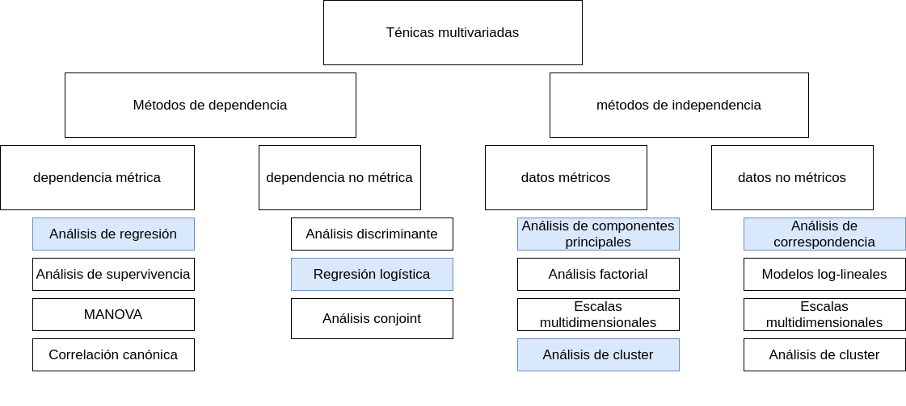

```{r setup, include=FALSE}
knitr::opts_chunk$set(echo = TRUE, comment = NA)
library(summarytools)


c1 ="#FF7F00"  # naranja - color primario 
c2 ="#034A94"  # azul oscuro - color secundario
c3 ="#0EB0C6"  # azul claro - color terciario
c4 ="#686868"  # gris - color texto
```

</br></br>


```{r, echo=FALSE, out.width="90%", fig.align = "center"}

```

</br></br>

Los métodos estadísticos multivariantes se pueden dividir en métodos de dependencia, métodos de independencia.
</br>

Cada categoría de métodos estadísticos tiene su propio conjunto de técnicas. Algunas de las técnicas más comunes incluyen:

</br>

* Análisis de regresión
* Análisis de supervivencia
* Análisis de la varianza
* Correlación canónica
* Análisis discriminante
* Modelos de regresión logística
* Análisis conjoint
* Análisis factorial
* Análisis de componentes principales
* Escalas multidimensionales
* Análisis de clúster
* Análisis de correspondencias
* Modelos log-lineales
* Modelos estructurales

</br>

Estas técnicas se pueden utilizar para analizar una amplia variedad de datos, incluyendo datos de encuestas, datos de experimentos y datos de observación. Pueden utilizarse para responder a una amplia variedad de preguntas, incluyendo:

</br>

* ¿Existe una relación entre dos o más variables?
* ¿Cómo se relaciona una variable con otra variable?
* ¿Qué factores influyen en una variable?
* ¿Cómo se puede predecir una variable a partir de otras variables?

</br>

Los métodos estadísticos son una herramienta poderosa que puede ser utilizada para analizar datos y extraer información de ellos. Pueden utilizarse para responder a una amplia variedad de preguntas y para tomar decisiones informadas.

</br></br>

En esta unidad se presentarán las principales características de los análisis de regresión, regresión logística, análisis de componentes principales, análisis de  conglomerados o cluster y el análisis de correspondencia.